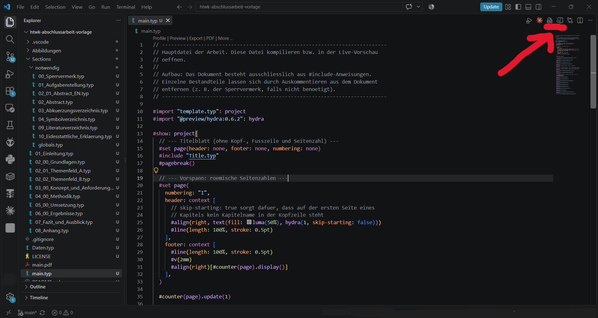

# Typst-Vorlage für Abschlussarbeiten an der HTWK Leipzig

Eine gebrauchsfertige Vorlage für Bachelor- und Masterarbeiten an der HTWK
Leipzig, umgesetzt in [Typst](https://typst.app). Sie enthält das vollständige
Layout (Titelblatt, Kopf- und Fußzeilen, Seitennummerierung, Verzeichnisse,
Beschriftungen, Zitierstil) sowie eine vorbereitete Kapitelstruktur mit
Platzhaltertexten.

> **Hinweis:** Die Vorlage ist keine amtliche Vorgabe der Hochschule. Formale
> Anforderungen (Titelblatt, Erklärungen, Umfang, Zitierstil) sind immer mit der
> aktuell gültigen Prüfungsordnung und der betreuenden Person abzugleichen.

## Was die Vorlage mitbringt

- Titelblatt im HTWK-Stil mit Fakultäts- und Hochschullogo
- Vorspann mit Aufgabenstellung, deutscher Kurzfassung, englischem Abstract,
  Inhalts-, Abbildungs-, Tabellen-, Abkürzungs- und Symbolverzeichnis
- Kapitelstruktur von der Einleitung bis zum Anhang, jeweils mit
  Platzhaltertexten, die beschreiben, was inhaltlich in den Abschnitt gehört
- Beispiele für Abbildungen (eingebundene Grafik und mit CeTZ gezeichnetes
  Diagramm), Tabellen, nummerierte Formeln und Querverweise
- Literaturverzeichnis über BibTeX mit IEEE-Zitierstil und Beispieleinträgen
- Eigenständigkeitserklärung und Erklärung zur Nutzung von KI-Werkzeugen auf
  einer gemeinsamen Seite, mit Ankreuzfeldern und optionaler Werkzeugtabelle
- Optionaler Sperrvermerk

## Benötigte Werkzeuge

Die Vorlage wird in **VS Code** mit der Erweiterung **Tinymist Typst**
geschrieben. Das ist der empfohlene und mit Abstand einfachste Weg, denn die
Erweiterung bringt Typst bereits mit. Eine separate Installation von Typst ist
damit **nicht** nötig.

1. [VS Code](https://code.visualstudio.com/) installieren.
2. In VS Code die Seitenleiste *Extensions* öffnen (`Strg` + `Umschalt` + `X`),
   nach **Tinymist Typst** suchen und die Erweiterung von *Myriad-Dreamin*
   installieren. Alternativ im Terminal:

   ```bash
   code --install-extension myriad-dreamin.tinymist
   ```

3. Den Projektordner in VS Code öffnen (*File → Open Folder*) und `main.typ`
   anklicken. Passende Editor-Einstellungen liegen bereits in
   `.vscode/settings.json`.

Darüber hinaus wird benötigt:

| Werkzeug | Zweck |
| --- | --- |
| Schriftart Times New Roman | in `template.typ` eingestellte Grundschrift, unter Windows und macOS bereits vorhanden |
| Internetzugang (einmalig) | zum Laden der Typst-Pakete beim ersten Kompilieren |

Verwendete Typst-Pakete (werden automatisch heruntergeladen und lokal
zwischengespeichert):

- `@preview/hydra:0.6.2` – Kapitelname in der Kopfzeile
- `@preview/cetz:0.3.4` – selbst gezeichnete Abbildungen

### Live-Vorschau und PDF-Export

Beides wird über zwei Schaltflächen oben rechts in der Editor-Leiste bedient,
während `main.typ` im Editor geöffnet ist:



- **Live-Vorschau** (Lupe auf geteilter Seite, rechte der beiden markierten
  Schaltflächen): öffnet das Dokument neben dem Editor. Die Vorschau
  aktualisiert sich bei jeder Änderung automatisch, ein Speichern ist dafür
  nicht nötig.
- **PDF-Export** (Symbol mit der Aufschrift „PDF", linke der beiden markierten
  Schaltflächen): erzeugt die fertige Datei `main.pdf` im Projektordner. Das
  ist die Datei, die am Ende abgegeben wird.

Dieselben Befehle stehen auch über der ersten Zeile von `main.typ` als Textlinks
*Preview* und *Export* zur Verfügung sowie in der Befehlspalette
(`Strg` + `Umschalt` + `P`) unter *Typst: Preview* und *Typst: Export PDF*.

Wer das PDF lieber bei jedem Speichern automatisch erzeugen lassen möchte,
setzt in `.vscode/settings.json` den Wert `"tinymist.exportPdf"` von `"never"`
auf `"onSave"`.

> **Wichtig:** Immer `main.typ` in der Vorschau öffnen, nicht eine einzelne
> Kapiteldatei. Nur `main.typ` enthält das vollständige Dokument mit Layout,
> Verzeichnissen und Literaturverzeichnis.

### Alternative: Typst über die Kommandozeile

Wer lieber ohne VS Code arbeitet, installiert die Typst-CLI (Version 0.12 oder
neuer):

```bash
winget install --id Typst.Typst    # Windows
brew install typst                 # macOS
```

```bash
typst watch   main.typ     # laufende Neuberechnung während des Schreibens
typst compile main.typ     # einmalige Ausgabe als main.pdf
```

## Vorlage verwenden

1. **Repository holen** – entweder über den Button *Use this template* auf
   GitHub oder per Klon:

   ```bash
   git clone <repository-url> meine-abschlussarbeit
   cd meine-abschlussarbeit
   ```

2. **Metadaten eintragen** – alle personenbezogenen Angaben stehen
   ausschließlich in [`Daten.typ`](Daten.typ). Dort Name, Matrikelnummer,
   Studiengang, Thema, Betreuende und Termine eintragen. Titelblatt,
   Aufgabenstellung, Kopfzeile und Erklärung übernehmen die Werte automatisch.

3. **Platzhalter ersetzen** – die Vorlage ist durchgängig mit `TODO` und
   `[PLATZHALTER ...]` markiert. Alle Fundstellen abarbeiten:

   ```bash
   grep -rn "TODO\|PLATZHALTER" --include="*.typ" --include="*.bib" .
   ```

4. **Schreiben und kompilieren** – `main.typ` öffnen, die Live-Vorschau
   starten und am Ende das PDF exportieren. Wie das geht, steht im Abschnitt
   [Live-Vorschau und PDF-Export](#live-vorschau-und-pdf-export).

## Aufbau des Repositorys

```
.
├── main.typ                   Hauptdatei, bindet alle Bestandteile ein
├── template.typ               globales Layout (Seite, Schrift, Nummerierung)
├── Daten.typ                  alle persönlichen Angaben, nur hier anpassen
├── Title.typ                  Titelblatt
├── references.bib             Literaturdatenbank (BibTeX)
├── Sections/
│   ├── 01_Einleitung.typ      … 08_Anhang.typ  die Kapitel des Hauptteils
│   └── notwendig/             Pflichtbestandteile und Verzeichnisse
│       ├── 00_Sperrvermerk.typ
│       ├── 01_Aufgabenstellung.typ
│       ├── 02_Abstract.typ, 02_01_Abstract_EN.typ
│       ├── 03_Abkuerzungsverzeichnis.typ, 04_Symbolverzeichnis.typ
│       ├── 09_Literaturverzeichnis.typ
│       ├── 10_Erklaerungen.typ
│       └── globals.typ        gemeinsame Hilfsfunktionen und Farben
├── Abbildungen/
│   ├── logos/                 HTWK-Logos für Titelblatt und Aufgabenstellung
│   └── beispiel/              Platzhaltergrafik und CeTZ-Beispiel
└── docs/                      Abbildungen für diese README, nicht Teil der Arbeit
```

## Konventionen der Vorlage

**Kapitel ein- und ausblenden.** In `main.typ` besteht das Dokument nur aus
`#include`-Zeilen. Nicht benötigte Bestandteile (etwa Sperrvermerk oder
Symbolverzeichnis) werden dort auskommentiert, statt die Dateien zu löschen.

**Überschriften** werden mit `=`, `==` und `===` gesetzt, nicht mit `#heading`.
Jede Überschrift erhält eine Marke, damit im Text auf sie verwiesen werden kann:

```typst
== Zielsetzung der Arbeit <sec:zielsetzung>

... wie in @sec:zielsetzung beschrieben ...
```

**Marken** folgen einem festen Präfix: `<sec:...>` für Abschnitte, `<fig:...>`
für Abbildungen, `<tab:...>` für Tabellen und `<eq:...>` für Gleichungen.

**Abbildungen und Tabellen** verwenden `flex-caption(lang, kurz)` aus
`Sections/notwendig/globals.typ`. Die lange Beschriftung erscheint unter der
Abbildung, die kurze im Abbildungs- beziehungsweise Tabellenverzeichnis.
Zusätzlich gehört zu jeder Abbildung ein `alt:`-Text für die Barrierefreiheit:

```typst
#figure(
  image("../Abbildungen/beispiel/platzhalter.svg", width: 70%),
  caption: flex-caption(
    [Ausführliche Beschriftung mit Quellenangabe. (Quelle: Eigene Darstellung)],
    [Kurze Beschriftung]
  ),
  alt: "Beschreibung der Abbildung für Screenreader."
)<fig:beispiel_bild>
```

Tabellenbeschriftungen stehen oberhalb, Abbildungsbeschriftungen unterhalb.
Das regelt `template.typ` automatisch.

**Gleichungen** werden fortlaufend nummeriert. Verweise erscheinen nur als
eingeklammerte Nummer, das Wort „Gleichung" wird bei Bedarf im Text ergänzt.

**Gezeichnete Abbildungen** werden mit CeTZ in eine eigene Datei unter
`Abbildungen/` ausgelagert und im Kapitel über `#include` eingebunden. Ein
vollständiges Beispiel liegt in
`Abbildungen/beispiel/beispiel_blockdiagramm.typ`. Achtung: Pfade löst Typst
relativ zu der Datei auf, in der der `image()`-Aufruf steht.

**Erklärungen am Ende der Arbeit.** Eigenständigkeitserklärung und Erklärung
zur Nutzung von KI-Werkzeugen stehen gemeinsam auf einer Seite. Sie liegt in
`Sections/notwendig/10_Erklaerungen.typ` und wird über die zugehörige
`#include`-Zeile in `main.typ` ein- und ausgeblendet. Innerhalb der Datei gibt
es zwei Stellschrauben:

- Der Schalter `#let zeige-werkzeugtabelle = true` blendet die Tabelle der
  eingesetzten Werkzeuge ein. Mit `false` entfällt sie ersatzlos, falls die
  betreuende Person sie nicht verlangt.
- Jedes Ankreuzfeld trägt einen eigenen Schalter. `#ankreuzfeld(an: true)[...]`
  setzt ein Kreuz in das Kästchen, `an: false` lässt es leer, damit es auf dem
  Ausdruck per Hand angekreuzt werden kann.

**Zitieren** erfolgt mit `@bibkey` auf Einträge in `references.bib`. Der
Zitierstil ist zentral in `Sections/notwendig/09_Literaturverzeichnis.typ`
eingestellt (Voreinstellung: IEEE). Alternativen sind beispielsweise `apa`,
`din-1505-2` oder `alphanumeric`.

## Häufige Stolpersteine

- **Vorschau bleibt leer oder zeigt nur ein Kapitel.** Die Vorschau bezieht
  sich immer auf die Datei, die beim Klick auf die Schaltfläche im Editor aktiv
  war. Vor dem Start also in den Tab `main.typ` wechseln.
- **Fehlende Schriftart.** Ist Times New Roman nicht installiert, weicht Typst
  auf eine Ersatzschrift aus. Unter Linux hilft das Paket
  `ttf-mscorefonts-installer`, alternativ wird die Schrift in `template.typ`
  auf eine vorhandene umgestellt (etwa „Liberation Serif").
- **Paketdownload schlägt fehl.** Das erste Kompilieren benötigt Internet, um
  `hydra` und `cetz` zu laden. Danach funktioniert es offline.
- **Verweis ohne Ziel.** Ein `@sec:...`, das auf keine vorhandene Marke zeigt,
  bricht den Satz mit einer Fehlermeldung ab. Marken und Verweise müssen exakt
  übereinstimmen.
- **Dezimaltrennzeichen.** Im deutschen Fließtext wird das Komma verwendet, in
  Typst-Formeln dafür `0","5` statt `0.5`.

## Lizenz

[MIT](LICENSE) für die Vorlage selbst. Die HTWK-Logos in `Abbildungen/logos/`
sind davon ausgenommen. Sie unterliegen dem Corporate Design der HTWK Leipzig
und dürfen nur im Rahmen von Arbeiten an der Hochschule verwendet werden.
